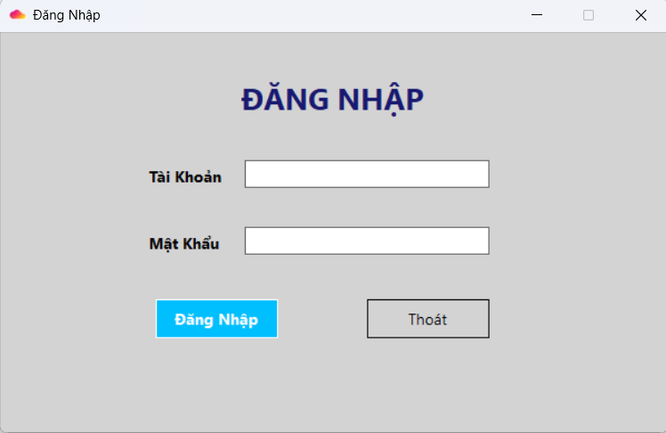
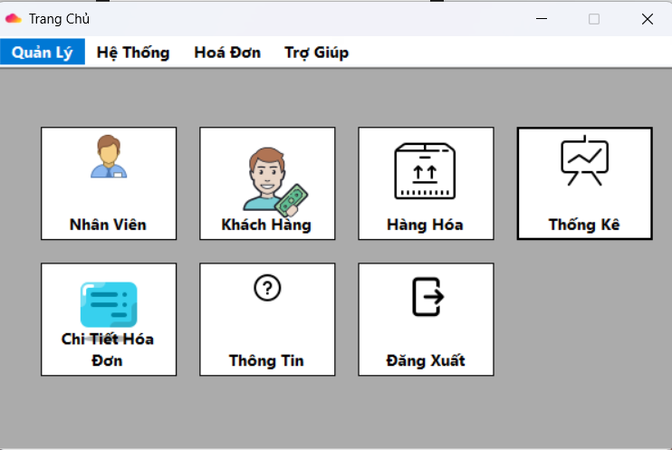
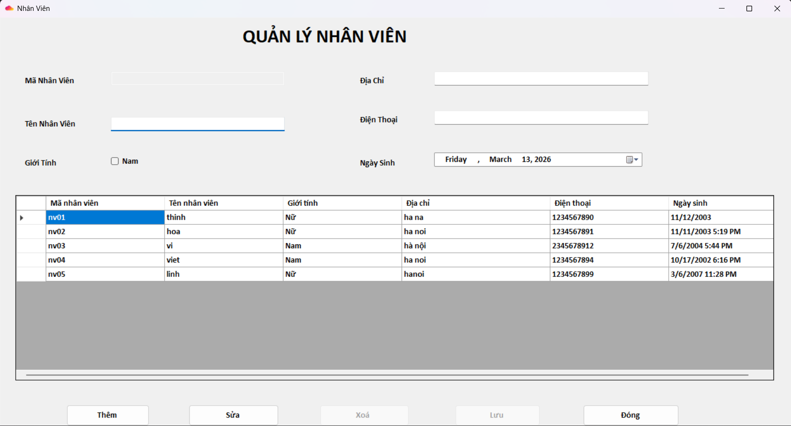
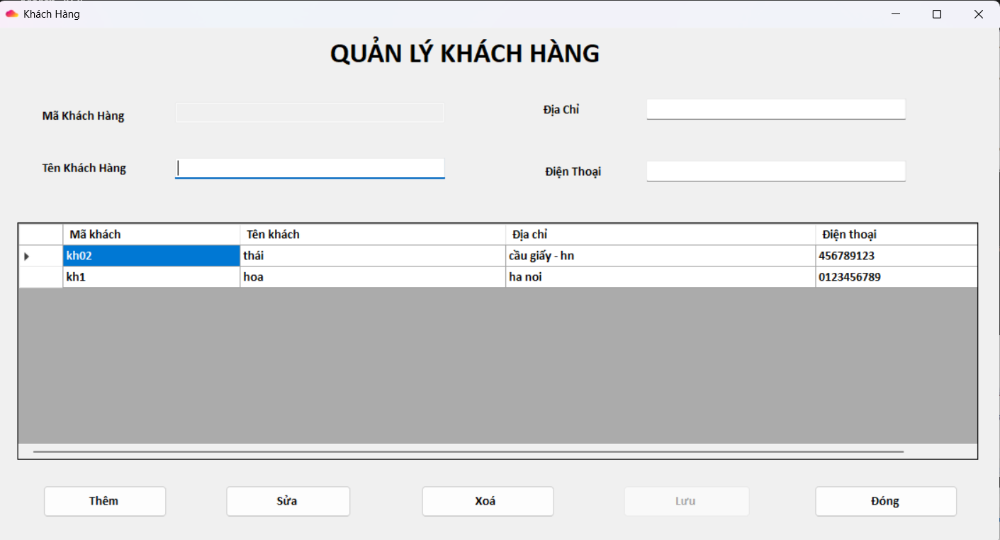
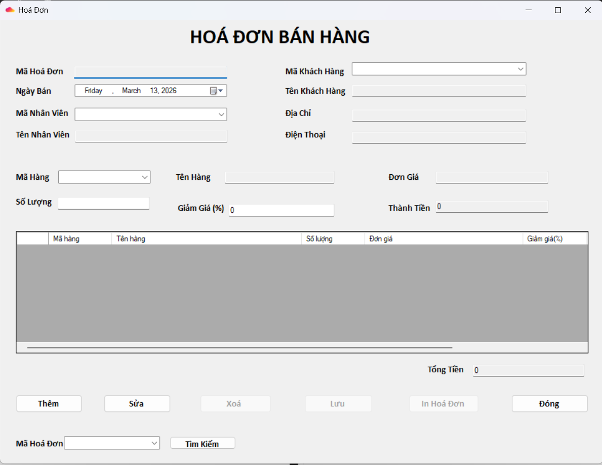
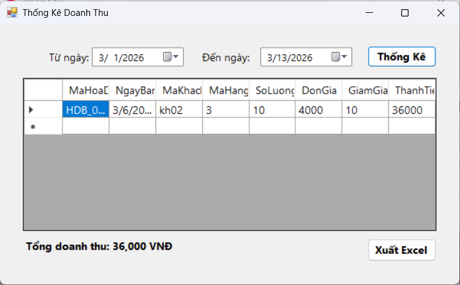

# 🛒 Quản Lý Cửa Hàng (Store Management System)
Ứng dụng quản lý cửa hàng được xây dựng bằng **C# WinForms** và **SQL Server**, giúp tối ưu hóa quy trình bán hàng, quản lý kho và nhân sự cho các cửa hàng nhỏ và vừa.
##  Về dự án này
Đây là dự án được tôi phát triển trong quá trình học tập về C# WinForms và quản lý cơ sở dữ liệu. 
* **Giai đoạn phát triển:** 2022 - 2023.
* **Tình trạng:** Vừa được tôi cấu trúc lại và đẩy lên GitHub vào tháng 3/2026 để quản lý source code chuyên nghiệp hơn và phục vụ mục đích showcase.
  
## - Các tính năng chính:
* **Quản lý Bán hàng:** Tạo hóa đơn, tính tiền, trừ tồn kho tự động.
* **Quản lý Kho:** Thêm/sửa/xóa hàng hóa, theo dõi tồn kho.
* **Quản lý Nhân viên & Khách hàng:** Lưu trữ thông tin chi tiết.
* **Bảo mật:** Hệ thống đăng nhập bảo mật (bảo vệ quyền truy cập dữ liệu).
* **Báo cáo:** Hỗ trợ xuất dữ liệu hóa đơn, tồn kho ra Excel nhanh chóng, giúp quản lý dữ liệu linh hoạt.

## - Công nghệ sử dụng:
* **Ngôn ngữ:** C# (.NET Framework)
* **Giao diện:** WinForms
* **Database:** SQL Server

## Cách cài đặt dự án (Khuyến khích)
Để tránh các lỗi hệ thống do Windows chặn file (Mark of the Web), vui lòng sử dụng lệnh `git clone` thay vì tải file ZIP:
link: https://github.com/Thinh02vq/QuanLyCuaHang.git

##  Lưu ý cho người tải file ZIP
Nếu bạn không sử dụng `git clone` mà tải file ZIP, sau khi giải nén, bạn có thể gặp lỗi `MSB3821`. Để khắc phục:
1. Chuột phải vào thư mục dự án zip vừa tải về.
2. Chọn **Properties**.
3. Tại tab **General**, tích vào ô **Unblock** ở dưới cùng.
4. Nhấn **Apply** sau đó **OK** để lưu thay đổi.
5. Mở dự án trong Visual Studio.

## -Hướng dẫn cài đặt Database
Để chạy dự án, bạn cần thực hiện khởi tạo database bằng file script đính kèm:

1.Mở SQL Server Management Studio (SSMS).

2.Mở file database.sql có trong thư mục project.

3.Nhấn Execute (F5) để khởi tạo database [QuanLyCuaHang] và các bảng cần thiết.

4. Mở file App.config trong project, cập nhật ConnectionString trỏ về Server của bạn.

## - Đang phát triển thêm:
Nâng cấp thuật toán bảo mật (Hash password với BCrypt/MD5).
Cải thiện giao diện (UI/UX) 

## Một số giao diện demo:
### Demo Giao Diện: Tài khoản và mật khẩu mặc định cho tài khoản admin là:`admin` `123456` (để dễ dàng đăng nhập và kiểm tra tính năng).

